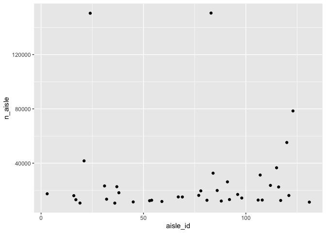
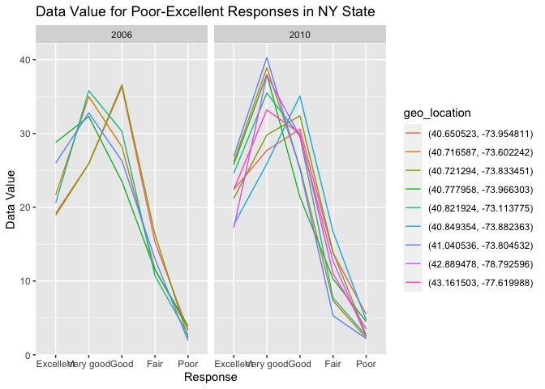

p8105_hw3_dfk2117
================
Dylan Koproski
2023-10-08

## Requried Data and Libraries

``` r
library(p8105.datasets)
library(tidyverse)
```

    ## ── Attaching core tidyverse packages ──────────────────────── tidyverse 2.0.0 ──
    ## ✔ dplyr     1.1.3     ✔ readr     2.1.4
    ## ✔ forcats   1.0.0     ✔ stringr   1.5.0
    ## ✔ ggplot2   3.4.3     ✔ tibble    3.2.1
    ## ✔ lubridate 1.9.2     ✔ tidyr     1.3.0
    ## ✔ purrr     1.0.2     
    ## ── Conflicts ────────────────────────────────────────── tidyverse_conflicts() ──
    ## ✖ dplyr::filter() masks stats::filter()
    ## ✖ dplyr::lag()    masks stats::lag()
    ## ℹ Use the conflicted package (<http://conflicted.r-lib.org/>) to force all conflicts to become errors

``` r
data("instacart")
data("brfss_smart2010")
```

## Problem 1

``` r
df_aisles = 
  instacart |> 
  group_by(aisle_id) |> 
  summarise(n_aisle = n()) |> 
  arrange(desc(n_aisle))

df_aisles
```

    ## # A tibble: 134 × 2
    ##    aisle_id n_aisle
    ##       <int>   <int>
    ##  1       83  150609
    ##  2       24  150473
    ##  3      123   78493
    ##  4      120   55240
    ##  5       21   41699
    ##  6      115   36617
    ##  7       84   32644
    ##  8      107   31269
    ##  9       91   26240
    ## 10      112   23635
    ## # ℹ 124 more rows

Using the `group_by()` function and the `summarise()` function, we see
that there are 134 different aisles. Further, using `arrange()`, we can
see that 83, 24,123,120,21 are the 5 most ordered-from aisles.

``` r
df_aisles |> 
  filter(n_aisle > 10000) |> 
  ggplot(aes(x = aisle_id, y = n_aisle)) +
  geom_point()
```

<!-- -->

``` r
df_bi_dfc_pvf = 
  instacart |> 
  filter(aisle == "baking ingredients", aisle == "dog food care", aisle == "packaged_vegetable_fruits")
```

## Problem 2

### Cleaning the dataframe

``` r
df_brfss =
  brfss_smart2010 |> 
  janitor::clean_names() |> 
  rename(state_abbr = locationabbr,
         state_county = locationdesc) |> 
  filter(topic == "Overall Health") |> 
  filter(response %in% c("Excellent", "Fair", "Very good", "Good", "Poor")) |> 
    mutate(response = factor(response, levels = c("Excellent", "Very good", "Good", "Fair", "Poor"), ordered = TRUE))
```

Here I make a dataframe called `df_brfss` so that I do not alter the
original dataframe. I used `clean_names()` to tidy the variable names,
but I also had to use the `rename()` function on `locationabbr` and
`locationdesc` since their names were not intuitive and difficult to
read. I used the `filter()` function two times, once to filter only the
`Overall Health` topic and the other to filter the specified
`responses`. Finally, I made response into a factor variable with levels
Excellent - Poor in descending order using `mutate()`.

### In 2002, which states were observed at 7 or more locations? What about in 2010?

``` r
n_state_2002 =
  df_brfss |> 
  filter(year == 2002) |> 
  group_by(state_abbr) |> 
  count(geo_location) |> 
  count(state_abbr) |> 
  filter(n >= 7)

n_state_2010 =
  df_brfss |> 
  filter(year == 2010) |> 
  group_by(state_abbr) |> 
  count(geo_location) |> 
  count(state_abbr) |> 
  filter(n >= 7)

n_state_2002
```

    ## # A tibble: 6 × 2
    ## # Groups:   state_abbr [6]
    ##   state_abbr     n
    ##   <chr>      <int>
    ## 1 CT             7
    ## 2 FL             7
    ## 3 MA             8
    ## 4 NC             7
    ## 5 NJ             8
    ## 6 PA            10

``` r
n_state_2010
```

    ## # A tibble: 14 × 2
    ## # Groups:   state_abbr [14]
    ##    state_abbr     n
    ##    <chr>      <int>
    ##  1 CA            12
    ##  2 CO             7
    ##  3 FL            41
    ##  4 MA             9
    ##  5 MD            12
    ##  6 NC            12
    ##  7 NE            10
    ##  8 NJ            19
    ##  9 NY             9
    ## 10 OH             8
    ## 11 PA             7
    ## 12 SC             7
    ## 13 TX            16
    ## 14 WA            10

I interpreted this question as looking for the number of states
(`state_abbr`) that contain observations from 7 or more unique
`geo_location`. I did this by first using `filter()` to focus on the
correct year, then I used the `group_by()` function to group the dataset
by state abbreviation. After this, I used `count()` twice, first to
count the occurrence of each unique `geo_location` observation within
each state, then another time to count the occurrence of each
`state_abbr` corresponding to each `geo_location`. Finally, I `filter()`
once more to only focus on states with greater than 7 locations. The
result is a count of unique `geo_location` observations within each
`state_abbr`. In 2002, 6 states were observed at 7 or more geographic
locations. In 2010, 14 states were observed at 7 or more geographic
locations.

### Construct a dataset that is limited to Excellent responses, and contains, year, state, and a variable that averages the data_value across locations within a state. Make a “spaghetti” plot of this average value over time within a state (that is, make a plot showing a line for each state across years – the geom_line geometry and group aesthetic will help).

``` r
df_exc_resp = 
  df_brfss |> 
  filter(response == 'Excellent') |> 
  group_by(year, state_abbr) |> 
  summarise(avg_dv_pct = mean(data_value)) |> 
  ungroup() |> 
  ggplot(aes(x = year, y = avg_dv_pct, group = state_abbr, color = state_abbr)) +
  geom_line() +
  labs(title = "Average Data Value of Excellent Responses Over Years by State",
       x = "Year",
       y = "Average Data Value (%)") +
  theme_minimal() +
  theme(legend.position = "right")
```

    ## `summarise()` has grouped output by 'year'. You can override using the
    ## `.groups` argument.

### Make a two-panel plot showing, for the years 2006, and 2010, distribution of data_value for responses (“Poor” to “Excellent”) among locations in NY State.

``` r
plot_dv_2006 =
  df_brfss |> 
  filter(year == 2006, 
         state_abbr == "NY", 
         response %in% c("Poor", "Fair", "Good", "Very good", "Excellent")) |> 
  group_by(year, geo_location, response) |> 
  ggplot(aes(x = response, y = data_value, group = geo_location, color = geo_location)) +
  geom_line() +
  facet_wrap(~ year, ncol = 2) +
  labs(title = "Data Value for Poor-Excellent Responses in NY State",
       x = "Response",
       y = "Data Value")

plot_dv_2010 =
  df_brfss |> 
  filter(year == 2010, 
         state_abbr == "NY", 
         response %in% c("Poor", "Fair", "Good", "Very good", "Excellent")) |> 
  group_by(year, geo_location, response) |> 
  ggplot(aes(x = response, y = data_value, group = geo_location, color = geo_location)) +
  geom_line() +
  facet_wrap(~ year, ncol = 2) +
  labs(title = "Data Value for Poor-Excellent Responses in NY State",
       x = "Response",
       y = "Data Value")


plot_dv_2006_2010 =
  df_brfss |> 
  filter(year %in% c(2006, 2010), 
         state_abbr == "NY", 
         response %in% c("Poor", "Fair", "Good", "Very good", "Excellent")) |> 
  group_by(year, geo_location, response) |> 
  ggplot(aes(x = response, y = data_value, group = geo_location, color = geo_location)) +
  geom_line() +
  facet_wrap(~ year, ncol = 2) +
  labs(title = "Data Value for Poor-Excellent Responses in NY State",
       x = "Response",
       y = "Data Value")

plot_dv_2006_2010
```

<!-- -->

## Problem 3
