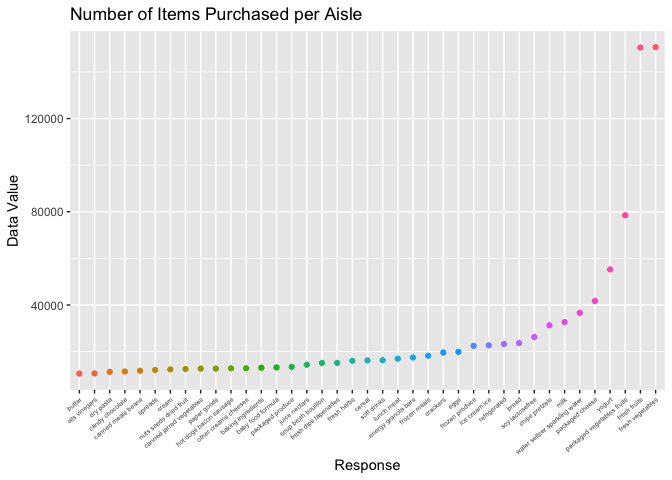
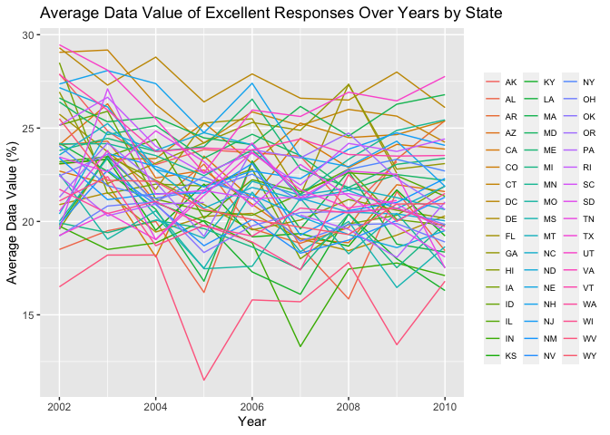
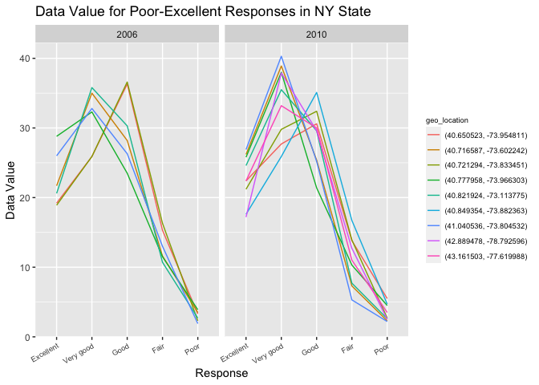
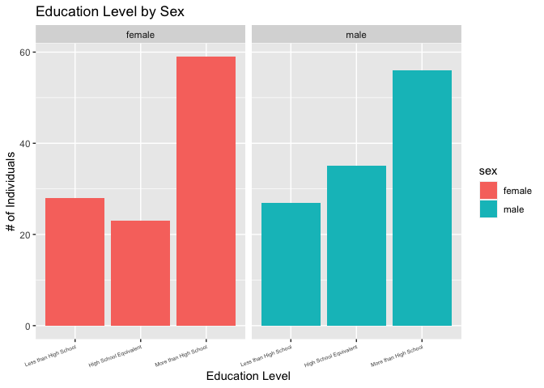

p8105_hw3_dfk2117
================
Dylan Koproski
2023-10-08

## Requried Data and Libraries

``` r
library(p8105.datasets)
library(tidyverse)
```

    ## ── Attaching core tidyverse packages ──────────────────────── tidyverse 2.0.0 ──
    ## ✔ dplyr     1.1.3     ✔ readr     2.1.4
    ## ✔ forcats   1.0.0     ✔ stringr   1.5.0
    ## ✔ ggplot2   3.4.3     ✔ tibble    3.2.1
    ## ✔ lubridate 1.9.2     ✔ tidyr     1.3.0
    ## ✔ purrr     1.0.2     
    ## ── Conflicts ────────────────────────────────────────── tidyverse_conflicts() ──
    ## ✖ dplyr::filter() masks stats::filter()
    ## ✖ dplyr::lag()    masks stats::lag()
    ## ℹ Use the conflicted package (<http://conflicted.r-lib.org/>) to force all conflicts to become errors

``` r
library(patchwork)
library(ggridges)
data("instacart")
data("brfss_smart2010")
```

## Problem 1

### First, putting the data into a tibble

``` r
instacart = 
  instacart |> 
  as_tibble()
```

``` r
df_aisles = 
  instacart |> 
  group_by(aisle) |> 
  summarise(n_aisle = n()) |> 
  arrange(desc(n_aisle))

df_aisles
```

    ## # A tibble: 134 × 2
    ##    aisle                         n_aisle
    ##    <chr>                           <int>
    ##  1 fresh vegetables               150609
    ##  2 fresh fruits                   150473
    ##  3 packaged vegetables fruits      78493
    ##  4 yogurt                          55240
    ##  5 packaged cheese                 41699
    ##  6 water seltzer sparkling water   36617
    ##  7 milk                            32644
    ##  8 chips pretzels                  31269
    ##  9 soy lactosefree                 26240
    ## 10 bread                           23635
    ## # ℹ 124 more rows

Using the `group_by()` function and the `summarise()` function, we see
that there are 134 different aisles. Further, using `arrange()`, we can
see that 83, 24,123,120,21 are the 5 most ordered-from aisles.

``` r
instacart |> 
  count(aisle) |> 
  filter(n > 10000) |> 
  mutate(aisle = fct_reorder(aisle, n)) |> 
  ggplot(aes(x = aisle, y = n, color = aisle)) + 
  geom_point() + 
  labs(title = "Number of items purchased per aisle",
       x = "Response",
       y = "Data Value") + 
  theme(axis.text.x = element_text(size = 5)) +
  theme(axis.text.x = element_text(angle = 40, hjust = 1)) +
  guides(color = FALSE)
```

    ## Warning: The `<scale>` argument of `guides()` cannot be `FALSE`. Use "none" instead as
    ## of ggplot2 3.3.4.
    ## This warning is displayed once every 8 hours.
    ## Call `lifecycle::last_lifecycle_warnings()` to see where this warning was
    ## generated.

<!-- -->

``` r
# I did this one very wrong the first go around, I pretty much got just to the mutate step, I corrected it based on the lecture notes
instacart |> 
  filter(aisle %in% c("baking ingredients", "dog food care", "packaged vegetables fruits")) |>
  group_by(aisle) |> 
  count(product_name) |> 
  mutate(rank = min_rank(desc(n))) |> 
  filter(rank < 4) |> 
  arrange(desc(n)) |>
  knitr::kable()
```

| aisle                      | product_name                                  |    n | rank |
|:---------------------------|:----------------------------------------------|-----:|-----:|
| packaged vegetables fruits | Organic Baby Spinach                          | 9784 |    1 |
| packaged vegetables fruits | Organic Raspberries                           | 5546 |    2 |
| packaged vegetables fruits | Organic Blueberries                           | 4966 |    3 |
| baking ingredients         | Light Brown Sugar                             |  499 |    1 |
| baking ingredients         | Pure Baking Soda                              |  387 |    2 |
| baking ingredients         | Cane Sugar                                    |  336 |    3 |
| dog food care              | Snack Sticks Chicken & Rice Recipe Dog Treats |   30 |    1 |
| dog food care              | Organix Chicken & Brown Rice Recipe           |   28 |    2 |
| dog food care              | Small Dog Biscuits                            |   26 |    3 |

``` r
instacart |>
  filter(product_name %in% c("Pink Lady Apples", "Coffee Ice Cream")) |>
  group_by(product_name, order_dow) |>
  summarize(mean_hour = mean(order_hour_of_day)) |>
  pivot_wider(
    names_from = order_dow, 
    values_from = mean_hour) |>
  knitr::kable(digits = 2)
```

    ## `summarise()` has grouped output by 'product_name'. You can override using the
    ## `.groups` argument.

| product_name     |     0 |     1 |     2 |     3 |     4 |     5 |     6 |
|:-----------------|------:|------:|------:|------:|------:|------:|------:|
| Coffee Ice Cream | 13.77 | 14.32 | 15.38 | 15.32 | 15.22 | 12.26 | 13.83 |
| Pink Lady Apples | 13.44 | 11.36 | 11.70 | 14.25 | 11.55 | 12.78 | 11.94 |

## Problem 2

### Cleaning the dataframe

``` r
df_brfss =
  brfss_smart2010 |> 
  janitor::clean_names() |> 
  rename(state_abbr = locationabbr,
         state_county = locationdesc) |> 
  filter(topic == "Overall Health") |> 
  filter(response %in% c("Excellent", "Fair", "Very good", "Good", "Poor")) |> 
  mutate(response = factor(response, levels = c("Excellent", "Very good", "Good", "Fair", "Poor"), ordered = TRUE))
```

Here I make a dataframe called `df_brfss` so that I do not alter the
original dataframe. I used `clean_names()` to tidy the variable names,
but I also had to use the `rename()` function on `locationabbr` and
`locationdesc` since their names were not intuitive and difficult to
read. I used the `filter()` function two times, once to filter only the
`Overall Health` topic and the other to filter the specified
`responses`. Finally, I made response into a factor variable with levels
Excellent - Poor in descending order using `mutate()`.

### In 2002, which states were observed at 7 or more locations? What about in 2010?

``` r
n_state_2002 =
  df_brfss |> 
  filter(year == 2002) |> 
  group_by(state_abbr) |> 
  count(geo_location) |> 
  count(state_abbr) |> 
  filter(n >= 7)

n_state_2010 =
  df_brfss |> 
  filter(year == 2010) |> 
  group_by(state_abbr) |> 
  count(geo_location) |> 
  count(state_abbr) |> 
  filter(n >= 7)

n_state_2002
```

    ## # A tibble: 6 × 2
    ## # Groups:   state_abbr [6]
    ##   state_abbr     n
    ##   <chr>      <int>
    ## 1 CT             7
    ## 2 FL             7
    ## 3 MA             8
    ## 4 NC             7
    ## 5 NJ             8
    ## 6 PA            10

``` r
n_state_2010
```

    ## # A tibble: 14 × 2
    ## # Groups:   state_abbr [14]
    ##    state_abbr     n
    ##    <chr>      <int>
    ##  1 CA            12
    ##  2 CO             7
    ##  3 FL            41
    ##  4 MA             9
    ##  5 MD            12
    ##  6 NC            12
    ##  7 NE            10
    ##  8 NJ            19
    ##  9 NY             9
    ## 10 OH             8
    ## 11 PA             7
    ## 12 SC             7
    ## 13 TX            16
    ## 14 WA            10

I interpreted this question as looking for the number of states
(`state_abbr`) that contain observations from 7 or more unique
`geo_location`. I did this by first using `filter()` to focus on the
correct year, then I used the `group_by()` function to group the dataset
by state abbreviation. After this, I used `count()` twice, first to
count the occurrence of each unique `geo_location` observation within
each state, then another time to count the occurrence of each
`state_abbr` corresponding to each `geo_location`. Finally, I `filter()`
once more to only focus on states with greater than 7 locations. The
result is a count of unique `geo_location` observations within each
`state_abbr`. In 2002, 6 states were observed at 7 or more geographic
locations. In 2010, 14 states were observed at 7 or more geographic
locations.

### Construct a dataset that is limited to Excellent responses, and contains, year, state, and a variable that averages the data_value across locations within a state. Make a “spaghetti” plot of this average value over time within a state (that is, make a plot showing a line for each state across years – the geom_line geometry and group aesthetic will help).

``` r
df_brfss |> 
  filter(response == 'Excellent') |> 
  group_by(year, state_abbr) |> 
  summarise(avg_dv_pct = mean(data_value)) |> 
  ungroup() |> 
  ggplot(aes(x = year, y = avg_dv_pct, group = state_abbr, color = state_abbr)) +
  geom_line() +
  labs(title = "Average Data Value of Excellent Responses Over Years by State",
       x = "Year",
       y = "Average Data Value (%)") +
  theme(legend.position = "right") +
  theme(legend.key.size = unit(1, 'cm'),
        legend.key.height = unit(0.5, 'cm'), 
        legend.key.width = unit(0.5, 'cm'), 
        legend.title = element_text(size=7),
        legend.text = element_text(size=7)) +
  scale_color_discrete(name="")
```

    ## `summarise()` has grouped output by 'year'. You can override using the
    ## `.groups` argument.

    ## Warning: Removed 3 rows containing missing values (`geom_line()`).

<!-- -->

### Make a two-panel plot showing, for the years 2006, and 2010, distribution of data_value for responses (“Poor” to “Excellent”) among locations in NY State.

``` r
df_brfss |> 
  filter(year %in% c(2006, 2010), 
         state_abbr == "NY", 
         response %in% c("Poor", "Fair", "Good", "Very good", "Excellent")) |> 
  group_by(year, geo_location, response) |> 
  ggplot(aes(x = response, y = data_value, group = geo_location, color = geo_location)) +
  geom_line() +
  facet_grid(~year) +
  labs(title = "Data Value for Poor-Excellent Responses in NY State",
       x = "Response",
       y = "Data Value") +
  theme(axis.text.x = element_text(size = 7)) +
  theme(axis.text.x = element_text(angle = 30, hjust = 1)) +
    theme(legend.position = "right") +
  theme(legend.key.size = unit(0.5, 'cm'),
        legend.key.height = unit(0.5, 'cm'), 
        legend.key.width = unit(0.5, 'cm'), 
        legend.title = element_text(size=7),
        legend.text = element_text(size=7))
```

<!-- -->

## Problem 3

### Load, tidy, merge, and otherwise organize the data sets. Your final dataset should include all originally observed variables; exclude participants less than 21 years of age, and those with missing demographic data; and encode data with reasonable variable classes (i.e. not numeric, and using factors with the ordering of tables and plots in mind).

``` r
df_covar = 
  read_csv("data/nhanes_covar.csv", skip = 4) |> 
  janitor::clean_names() |> 
  mutate(sex = 
           case_match(sex,
                      1 ~ "male",
                      2 ~ "female")) |> 
  mutate(education = 
           case_match(education,
                      1 ~ "less_than_hs",
                      2 ~ "equivalent_hs",
                      3 ~ "more_than_hs")) |>
  mutate(education = factor(education, levels = c("less_than_hs", 
                                                  "equivalent_hs", 
                                                  "more_than_hs"), 
                                                  ordered = TRUE)) |> 
  filter(age >= 21) |> 
  drop_na(sex, age, bmi, education)
```

    ## Rows: 250 Columns: 5
    ## ── Column specification ────────────────────────────────────────────────────────
    ## Delimiter: ","
    ## dbl (5): SEQN, sex, age, BMI, education
    ## 
    ## ℹ Use `spec()` to retrieve the full column specification for this data.
    ## ℹ Specify the column types or set `show_col_types = FALSE` to quiet this message.

``` r
df_accel = 
  read_csv("data/nhanes_accel.csv") |> 
  janitor::clean_names() |> 
  pivot_longer(min1:min1440, names_to = "time_interval")
```

    ## Rows: 250 Columns: 1441
    ## ── Column specification ────────────────────────────────────────────────────────
    ## Delimiter: ","
    ## dbl (1441): SEQN, min1, min2, min3, min4, min5, min6, min7, min8, min9, min1...
    ## 
    ## ℹ Use `spec()` to retrieve the full column specification for this data.
    ## ℹ Specify the column types or set `show_col_types = FALSE` to quiet this message.

``` r
df_merged =
  inner_join(df_accel, df_covar)
```

    ## Joining with `by = join_by(seqn)`

### Produce a reader-friendly table for the number of men and women in each education category, and create a visualization of the age distributions for men and women in each education category. Comment on these items.

``` r
 df_merged |> 
  group_by(sex, education) |> 
  summarise(count = n()) |> 
  arrange(sex, education) |> 
  knitr::kable()
```

    ## `summarise()` has grouped output by 'sex'. You can override using the `.groups`
    ## argument.

| sex    | education     | count |
|:-------|:--------------|------:|
| female | less_than_hs  | 40320 |
| female | equivalent_hs | 33120 |
| female | more_than_hs  | 84960 |
| male   | less_than_hs  | 38880 |
| male   | equivalent_hs | 50400 |
| male   | more_than_hs  | 80640 |

``` r
df_merged |> 
  ggplot(aes(x = education, fill = sex)) +
  facet_grid(~sex) +
  geom_bar() +
    labs(title = "Education Level by Sex",
       x = "Education Level",
       y = "# of Individuals") +
  theme(axis.text.x = element_text(size = 5)) +
  theme(axis.text.x = element_text(angle = 20, hjust = 1)) +
  scale_x_discrete(labels = c(equivalent_hs = "High School Equivalent", "less_than_hs" = "Less than High School", "more_than_hs" = "More than High School"))
```

<!-- -->

### Traditional analyses of accelerometer data focus on the total activity over the day. Using your tidied dataset, aggregate across minutes to create a total activity variable for each participant. Plot these total activities (y-axis) against age (x-axis); your plot should compare men to women and have separate panels for each education level. Include a trend line or a smooth to illustrate differences. Comment on your plot.

### Accelerometer data allows the inspection activity over the course of the day. Make a three-panel plot that shows the 24-hour activity time courses for each education level and use color to indicate sex. Describe in words any patterns or conclusions you can make based on this graph; including smooth trends may help identify differences.
