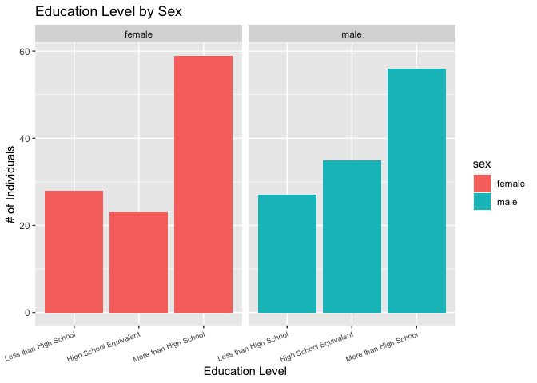
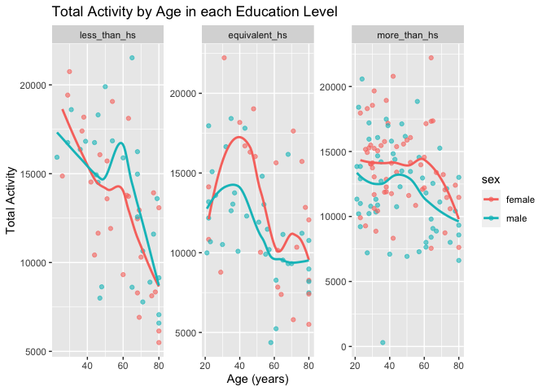

p8105_hw3_dfk2117
================
Dylan Koproski
2023-10-08

## Requried Data and Libraries

``` r
library(p8105.datasets)
library(tidyverse)
```

    ## ── Attaching core tidyverse packages ──────────────────────── tidyverse 2.0.0 ──
    ## ✔ dplyr     1.1.3     ✔ readr     2.1.4
    ## ✔ forcats   1.0.0     ✔ stringr   1.5.0
    ## ✔ ggplot2   3.4.3     ✔ tibble    3.2.1
    ## ✔ lubridate 1.9.2     ✔ tidyr     1.3.0
    ## ✔ purrr     1.0.2     
    ## ── Conflicts ────────────────────────────────────────── tidyverse_conflicts() ──
    ## ✖ dplyr::filter() masks stats::filter()
    ## ✖ dplyr::lag()    masks stats::lag()
    ## ℹ Use the conflicted package (<http://conflicted.r-lib.org/>) to force all conflicts to become errors

``` r
library(patchwork)
library(ggridges)
data("instacart")
data("brfss_smart2010")
```

## Problem 1

### First, putting the data into a tibble

``` r
instacart = 
  instacart |> 
  as_tibble()
```

This chunk takes the `instacart` data from the `p8105.datasets` and
saves it as a tibble that I can manipulate later. This dataframe
contains nearly 1.4 million observations of 15 variables. These
variables include but are not limited to order id’s for each order, the
id of the product ordered, whether or not the item was reordered, the
time of the order (split in day of week, and hour).

### How many aisles are there, and which aisles are the most items ordered from?

``` r
df_aisles = 
  instacart |> 
  group_by(aisle) |> 
  summarise(n_aisle = n()) |> 
  arrange(desc(n_aisle))

df_aisles
```

    ## # A tibble: 134 × 2
    ##    aisle                         n_aisle
    ##    <chr>                           <int>
    ##  1 fresh vegetables               150609
    ##  2 fresh fruits                   150473
    ##  3 packaged vegetables fruits      78493
    ##  4 yogurt                          55240
    ##  5 packaged cheese                 41699
    ##  6 water seltzer sparkling water   36617
    ##  7 milk                            32644
    ##  8 chips pretzels                  31269
    ##  9 soy lactosefree                 26240
    ## 10 bread                           23635
    ## # ℹ 124 more rows

Using the `group_by()` function and the `summarise()` function, we see
that there are 134 different aisles. Further, using `arrange()`, we can
see that 83, 24,123,120,21 are the 5 most ordered-from aisles. These
correspond to the fresh vegetables, fresh fruits, packaged vegetable
fruits, yogurt and packaged cheese aisles. I feel like the fresh fruits
and fresh vegetable aisles have a disproportionately large number of
items because produce is usually sold individually, so maybe each
individual fruit/vegetable is being counted as an item.

### Number of items ordered in each aisle

``` r
instacart |> 
  count(aisle) |> 
  filter(n > 10000) |> 
  mutate(aisle = fct_reorder(aisle, n)) |> 
  ggplot(aes(x = aisle, y = n, color = aisle)) + 
  geom_point() + 
  labs(title = "Number of Items Purchased per Aisle",
       x = "Response",
       y = "Data Value") + 
  theme(axis.text.x = element_text(size = 5)) +
  theme(axis.text.x = element_text(angle = 40, hjust = 1)) +
  guides(color = FALSE)
```

    ## Warning: The `<scale>` argument of `guides()` cannot be `FALSE`. Use "none" instead as
    ## of ggplot2 3.3.4.
    ## This warning is displayed once every 8 hours.
    ## Call `lifecycle::last_lifecycle_warnings()` to see where this warning was
    ## generated.

<!-- -->

The above code first uses `count()` to count the number of items ordered
from each aisle, then `filter()` restricts this value to only those
greater than 10,000 items. The `fct_reorder()` function is then used
inside of `mutate()` to reordee the `aisle` variable accordig to the new
`n` variable. The remaining code creates a ggplot using `geom_point()`
with `x = aisle` and `y = n`. The remaining code is aesthetics to make
the plot more human-readable. Fresh vegetables and fresh fruits are the
highest sellers by a large margin.

### Three most popular items in each of the aisles “baking ingredients”, “dog food care”, and “packaged vegetables fruits”

``` r
# I did this one very wrong the first go around, I pretty much got just to the mutate step, I corrected it based on the homework notes
instacart |> 
  filter(aisle %in% c("baking ingredients", "dog food care", "packaged vegetables fruits")) |>
  group_by(aisle) |> 
  count(product_name) |> 
  mutate(rank = min_rank(desc(n))) |> 
  filter(rank < 4) |> 
  arrange(desc(n)) |>
  knitr::kable()
```

| aisle                      | product_name                                  |    n | rank |
|:---------------------------|:----------------------------------------------|-----:|-----:|
| packaged vegetables fruits | Organic Baby Spinach                          | 9784 |    1 |
| packaged vegetables fruits | Organic Raspberries                           | 5546 |    2 |
| packaged vegetables fruits | Organic Blueberries                           | 4966 |    3 |
| baking ingredients         | Light Brown Sugar                             |  499 |    1 |
| baking ingredients         | Pure Baking Soda                              |  387 |    2 |
| baking ingredients         | Cane Sugar                                    |  336 |    3 |
| dog food care              | Snack Sticks Chicken & Rice Recipe Dog Treats |   30 |    1 |
| dog food care              | Organix Chicken & Brown Rice Recipe           |   28 |    2 |
| dog food care              | Small Dog Biscuits                            |   26 |    3 |

This code first filters out the three aisles of interest, then uses
`group_by()` to ensure that the `count(product_name)` function counts
products within each aisle. Next, a new `rank` variable is made with
`mutate()` to rank, in descending order, the most popular items for
aisle. Then the top 3 ranks are filtered and arranged in descending
order. The result is a table that is not reader friendly, so
`knitr::kable()` is used to make it readable. Light Brown Sugar is the
most popular item in the baking aisle, Snack Sticks Chicken & Rice
Recipe Dog Treats is the most popular in the dog food care aisle and
Organic Baby Spinach is the most popular in packaged vegetables fruits.

### Mean hour of the day at which Pink Lady Apples and Coffee Ice Cream are ordered on each day of the week

``` r
instacart |>
  filter(product_name %in% c("Pink Lady Apples", "Coffee Ice Cream")) |>
  group_by(product_name, order_dow) |>
  summarize(mean_hour = mean(order_hour_of_day)) |>
  pivot_wider(
    names_from = order_dow, 
    values_from = mean_hour) |>
  knitr::kable(digits = 2)
```

    ## `summarise()` has grouped output by 'product_name'. You can override using the
    ## `.groups` argument.

| product_name     |     0 |     1 |     2 |     3 |     4 |     5 |     6 |
|:-----------------|------:|------:|------:|------:|------:|------:|------:|
| Coffee Ice Cream | 13.77 | 14.32 | 15.38 | 15.32 | 15.22 | 12.26 | 13.83 |
| Pink Lady Apples | 13.44 | 11.36 | 11.70 | 14.25 | 11.55 | 12.78 | 11.94 |

`filter()` is used to only show the `Pink Lady Apple` and
`Coffee Ice Cream` product names. Then we `group_by()` the product name,
and the order day of the week. Then `summarize()` calculates the
`mean(order_hour_of_day)` based on the grouped parameters. Next
`pivot_wider()` takes the table we have and effectively flips it on its
side so we have the `order_dow` as the top row of the table.
`knitr::kable()` is then used with `digits = 2` to make a reader
friendly table rounded to 2 digits. It looks like both coffee ice cream
and pink lady apples are order the latest in the day on average on
tuesday and wednesday respectively.

## Problem 2

### Cleaning the dataframe

``` r
df_brfss =
  brfss_smart2010 |> 
  janitor::clean_names() |> 
  rename(state_abbr = locationabbr,
         state_county = locationdesc) |> 
  filter(topic == "Overall Health") |> 
  filter(response %in% c("Excellent", "Fair", "Very good", "Good", "Poor")) |> 
  mutate(response = factor(response, levels = c("Excellent", "Very good", "Good", "Fair", "Poor"), ordered = TRUE))
```

Here I make a dataframe called `df_brfss` so that I do not alter the
original dataframe. I used `clean_names()` to tidy the variable names,
but I also had to use the `rename()` function on `locationabbr` and
`locationdesc` since their names were not intuitive and difficult to
read. I used the `filter()` function two times, once to filter only the
`Overall Health` topic and the other to filter the specified
`responses`. Finally, I made response into a factor variable with levels
Excellent - Poor in descending order using `mutate()`. The resulting
dataset has 10,625 observations of 23 variables. These include, but are
not limited to data_value, location variables (including the state
abbreviation and state county) a response variable ranging from poor to
excellent and the sample_size.

### In 2002, which states were observed at 7 or more locations? What about in 2010?

``` r
n_state_2002 =
  df_brfss |> 
  filter(year == 2002) |> 
  group_by(state_abbr) |> 
  count(geo_location) |> 
  count(state_abbr) |> 
  filter(n >= 7)

n_state_2010 =
  df_brfss |> 
  filter(year == 2010) |> 
  group_by(state_abbr) |> 
  count(geo_location) |> 
  count(state_abbr) |> 
  filter(n >= 7)

n_state_2002
```

    ## # A tibble: 6 × 2
    ## # Groups:   state_abbr [6]
    ##   state_abbr     n
    ##   <chr>      <int>
    ## 1 CT             7
    ## 2 FL             7
    ## 3 MA             8
    ## 4 NC             7
    ## 5 NJ             8
    ## 6 PA            10

``` r
n_state_2010
```

    ## # A tibble: 14 × 2
    ## # Groups:   state_abbr [14]
    ##    state_abbr     n
    ##    <chr>      <int>
    ##  1 CA            12
    ##  2 CO             7
    ##  3 FL            41
    ##  4 MA             9
    ##  5 MD            12
    ##  6 NC            12
    ##  7 NE            10
    ##  8 NJ            19
    ##  9 NY             9
    ## 10 OH             8
    ## 11 PA             7
    ## 12 SC             7
    ## 13 TX            16
    ## 14 WA            10

I interpreted this question as looking for the number of states
(`state_abbr`) that contain observations from 7 or more unique
`geo_location`. I did this by first using `filter()` to focus on the
correct year, then I used the `group_by()` function to group the dataset
by state abbreviation. After this, I used `count()` twice, first to
count the occurrence of each unique `geo_location` observation within
each state, then another time to count the occurrence of each
`state_abbr` corresponding to each `geo_location`. Finally, I `filter()`
once more to only focus on states with greater than 7 locations. The
result is a count of unique `geo_location` observations within each
`state_abbr`. In 2002, 6 states were observed at 7 or more geographic
locations. In 2010, 14 states were observed at 7 or more geographic
locations.

### Construct a dataset that is limited to Excellent responses, and contains, year, state, and a variable that averages the data_value across locations within a state. Make a “spaghetti” plot of this average value over time within a state (that is, make a plot showing a line for each state across years – the geom_line geometry and group aesthetic will help).

``` r
df_brfss |> 
  filter(response == 'Excellent') |> 
  group_by(year, state_abbr) |> 
  summarise(avg_dv_pct = mean(data_value)) |> 
  ggplot(aes(x = year, y = avg_dv_pct, group = state_abbr, color = state_abbr)) +
  geom_line() +
  labs(title = "Average Data Value of Excellent Responses Over Years by State",
       x = "Year",
       y = "Average Data Value (%)") +
  theme(legend.position = "right") +
  theme(legend.key.size = unit(1, 'cm'),
        legend.key.height = unit(0.5, 'cm'), 
        legend.key.width = unit(0.5, 'cm'), 
        legend.title = element_text(size=7),
        legend.text = element_text(size=7)) +
  scale_color_discrete(name="")
```

    ## `summarise()` has grouped output by 'year'. You can override using the
    ## `.groups` argument.

    ## Warning: Removed 3 rows containing missing values (`geom_line()`).

<!-- -->

The above code takes the tidied dataset I made in the data manipulation
step, Uses `filter()` to focus on only excellent responses, uses
`group_by()` to group the year and abbreviated state name variables. I
then use `summarise()` to calculate the average data value in these
groups. Next, I make a `geom_line()` plot with year along the x-axis and
the average data percent on the y - axis. I group by and color by the
abbreviated state name so that each state gets its own individual
colored line. I also made some tweaks to the legend using arguments I
found on stackoverflow because it was too intrusive and was taking away
from the main plot. This plot is hard to read as there are so many
states and the colors begin to blend.

### Make a two-panel plot showing, for the years 2006, and 2010, distribution of data_value for responses (“Poor” to “Excellent”) among locations in NY State.

``` r
df_brfss |> 
  filter(year %in% c(2006, 2010), 
         state_abbr == "NY", 
         response %in% c("Poor", "Fair", "Good", "Very good", "Excellent")) |> 
  ggplot(aes(x = response, y = data_value, group = geo_location, color = geo_location)) +
  geom_line() +
  facet_wrap(~year) +
  labs(title = "Data Value for Poor-Excellent Responses in NY State",
       x = "Response",
       y = "Data Value") +
  theme(axis.text.x = element_text(size = 7)) +
  theme(axis.text.x = element_text(angle = 30, hjust = 1)) +
    theme(legend.position = "right") +
  theme(legend.key.size = unit(0.5, 'cm'),
        legend.key.height = unit(0.5, 'cm'), 
        legend.key.width = unit(0.5, 'cm'), 
        legend.title = element_text(size=7),
        legend.text = element_text(size=7))
```

<!-- -->

To accomplish this, I first use `filter()` with three arguments: the
years 2006 and 2010, the state New York, and responses from `poor` to
`excellent`. I then use `geom_line()` with response on the x-axis and
the data value on the y-axis. This creates one plot with the desired
information (namely data value vs. response with lines for each
location), but it combines the two years. To remedy this,
`facet_wrap(~year)` is used which creates an individual plot for each
year. The remaining code focuses on the aesthetics as I attempt to make
the plot more reader friendly by changing the size, shape and angle of
text. It looks like there is an incrase in `very good` responses in 2010
when compared to 2006. Both years have comparable amounts of poor, fair,
good and excellent responses, though.

## Problem 3

### Load, tidy, merge, and otherwise organize the data sets. Your final dataset should include all originally observed variables; exclude participants less than 21 years of age, and those with missing demographic data; and encode data with reasonable variable classes (i.e. not numeric, and using factors with the ordering of tables and plots in mind).

``` r
df_covar = 
  read_csv("data/nhanes_covar.csv", skip = 4) |> 
  janitor::clean_names() |> 
  mutate(sex = 
           case_match(sex,
                      1 ~ "male",
                      2 ~ "female")) |> 
  mutate(education = 
           case_match(education,
                      1 ~ "less_than_hs",
                      2 ~ "equivalent_hs",
                      3 ~ "more_than_hs")) |>
  mutate(education = factor(education, levels = c("less_than_hs", 
                                                  "equivalent_hs", 
                                                  "more_than_hs"), 
                                                  ordered = TRUE)) |> 
  filter(age >= 21) |> 
  drop_na(sex, age, bmi, education)
```

    ## Rows: 250 Columns: 5
    ## ── Column specification ────────────────────────────────────────────────────────
    ## Delimiter: ","
    ## dbl (5): SEQN, sex, age, BMI, education
    ## 
    ## ℹ Use `spec()` to retrieve the full column specification for this data.
    ## ℹ Specify the column types or set `show_col_types = FALSE` to quiet this message.

``` r
df_accel = 
  read_csv("data/nhanes_accel.csv") |> 
  janitor::clean_names()
```

    ## Rows: 250 Columns: 1441
    ## ── Column specification ────────────────────────────────────────────────────────
    ## Delimiter: ","
    ## dbl (1441): SEQN, min1, min2, min3, min4, min5, min6, min7, min8, min9, min1...
    ## 
    ## ℹ Use `spec()` to retrieve the full column specification for this data.
    ## ℹ Specify the column types or set `show_col_types = FALSE` to quiet this message.

``` r
df_nhanes =
  inner_join(df_accel, df_covar) 
```

    ## Joining with `by = join_by(seqn)`

My first step in tidying the data is to `read_csv()` with the `skip = 4`
argument since the first 4 rows of the data explain what the numerical
levels correspond to. I then clean names. Next, I use `mutate()` three
times. The first time I convert the sex variable to male and female
based on the numerical levels. I do the same for the education variable
changing the three numerical levels to accurate descriptions of the
education level. I finally mutate the education variable using
`factor()` to order the levels from lowest to highest education level.
Finally I `filter()` by age greater than or equal to 21 and drop the
requested demographic NAs. I do a simpler process for the accelerometer
dataset as it does not require much tidying. I considered
`pivot_longer()` here to collapse the `min1:min1440` variables into one
variable with names to `time_interval` and values to `accel_value`, but
this created a very unweildy dataset that lagged when I manipulated it.
I instead just merged the datasets as they were using `inner_join`. The
resuling data set has 228 observations of 1445 variables. This is
deceiving, though, as only six of these are unique: seqn, sex, age, bmi,
education and min1-min1440 (which are effectively one variable).

### Produce a reader-friendly table for the number of men and women in each education category, and create a visualization of the age distributions for men and women in each education category. Comment on these items.

``` r
 df_nhanes |> 
  group_by(sex, education) |> 
  summarise(count = n()) |> 
  knitr::kable()
```

    ## `summarise()` has grouped output by 'sex'. You can override using the `.groups`
    ## argument.

| sex    | education     | count |
|:-------|:--------------|------:|
| female | less_than_hs  |    28 |
| female | equivalent_hs |    23 |
| female | more_than_hs  |    59 |
| male   | less_than_hs  |    27 |
| male   | equivalent_hs |    35 |
| male   | more_than_hs  |    56 |

This creates a table with the counts of each education level within each
sex. Then `knitr::kable()` makes the table more readable.

``` r
df_nhanes |> 
  ggplot(aes(x = education, fill = sex)) +
  geom_bar() +
    labs(
      title = "Education Level by Sex",
       x = "Education Level",
       y = "# of Individuals") +
  facet_wrap(~sex) +
  scale_x_discrete(labels = c(equivalent_hs = "High School Equivalent", "less_than_hs" = "Less than High School", "more_than_hs" = "More than High School")) +
  theme(axis.text.x = element_text(size = 7)) +
  theme(axis.text.x = element_text(angle = 20, hjust = 1))
```

<!-- -->

This makes a `geom_bar()` plot with x as education and colored by sex.
This plot would normally be a stacked bar plot, but using `facet_wrap()`
by `~sex` it turns into a side by side bar plot with one graph for each
sex. Next, I change the labels to make them more descriptive and change
the sizes and angle of the text to make them reader friendly. Comparable
amounts of individuals have more than high school for both sexes, but it
looks like more males have a high school equivalent than females and
more females have less than high school than males.

### Traditional analyses of accelerometer data focus on the total activity over the day. Using your tidied dataset, aggregate across minutes to create a total activity variable for each participant. Plot these total activities (y-axis) against age (x-axis); your plot should compare men to women and have separate panels for each education level. Include a trend line or a smooth to illustrate differences. Comment on your plot.

``` r
df_nhanes |> 
  group_by(seqn) |> 
  mutate(total_activity = 
           sum(
             across(
               starts_with("min")))) |>
  ggplot(aes(x = age, y = total_activity, color = sex)) + 
  geom_point(alpha=0.6) + 
  geom_smooth(method = "loess", se = FALSE) +
  facet_wrap(~education, scales = "free") +
  labs(title = "Total Activity by Age in each Education Level", x = "Age (years)", y = "Total Activity") 
```

    ## `geom_smooth()` using formula = 'y ~ x'

<!-- -->

I had some trouble getting this one to work properly, but ultimately my
main issue was that I didn’t `group_by(seqn)` initially. I mutate a new
total_activity variable as a sum across the row of all variables
starting with `min`. The resulting variable has the sum of each of the
1440 activity values corresponding to each minute for each individual
`seqn`. Next I make a ggplot with `geom_point()` set to an alpha of 0.6
and `geom_smooth()` with method `loess` as I feel that it was more
descriptive than `lm`. I then `facet_wrap()` by education and change the
axis title. It looks like males of age 40+ have higher activity than
females in the less than high school education level, but females have
higher activity than makes everywhere else. Activity decreases with age
in all categories, but in the more than high school category this
decrease is much less pronounced.

### Accelerometer data allows the inspection activity over the course of the day. Make a three-panel plot that shows the 24-hour activity time courses for each education level and use color to indicate sex. Describe in words any patterns or conclusions you can make based on this graph; including smooth trends may help identify differences.

``` r
df_nhanes |> 
  pivot_longer(min1:min1440, names_to = "minute", values_to = "activity") |> 
  mutate(minute = as.numeric(str_replace(minute, "min", ""))) |> 
  ggplot(aes(x = minute, y = activity, color = sex)) +
  geom_point() +
  facet_wrap(~education)
```

<!-- -->

In order to make this plot, I used `pivot_longer()` to make one minute
variable with corresponding activity values for each minute. I then used
`mutate()`, `as.numeric()` and `str_replace()` in order to convert the
minute variable into a number from 1 to 1500. I then plotted it using
`geom_point()` and applied a trend line using `geom_smooth()`. Lastly, I
used `facet_wrap()` to make separate plots for each education level.
Overall, it seems that individuals with less than high school or the
high school equivalent have less activity than more than high school
individuals. Those with more than high school have two peaks in activity
throughout the day, one near the beginning of data collection and one at
the end of data collection.
